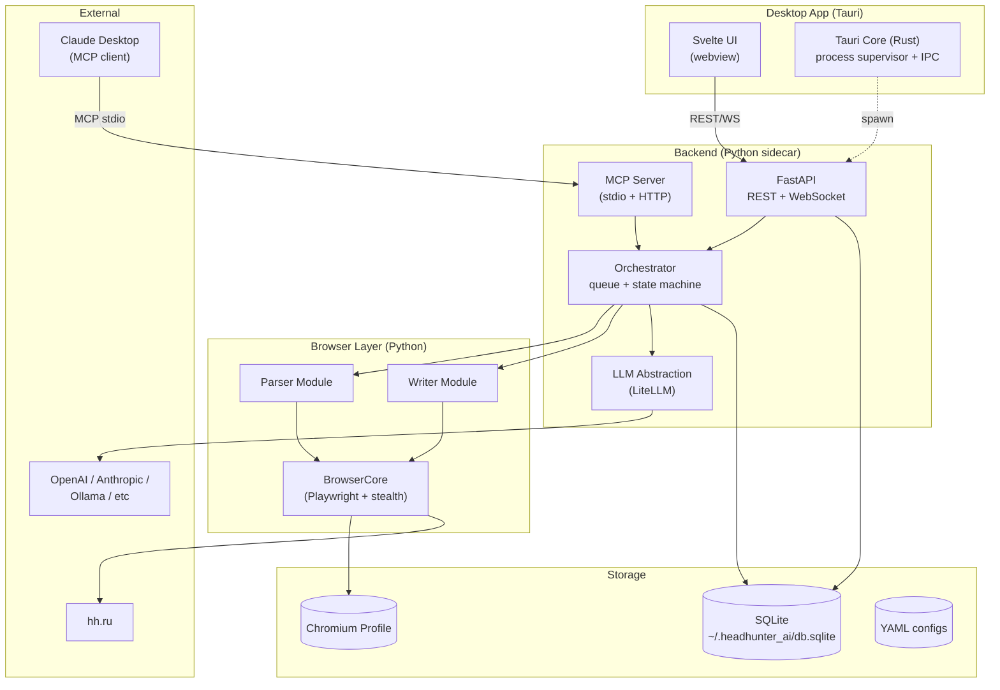

# Architecture

Общая архитектура [[Description|Headhunter AI]].

## Диаграмма

## Ключевые архитектурные решения

### 1. Tauri shell + Python sidecar
[[UI]] работает в Rust-обёртке, бэкенд запускается как дочерний процесс через Tauri sidecar API. Tauri следит за жизненным циклом, рестартит при падении.

### 2. Один Chromium-инстанс на пользователя
[[Parser service]] и [[Writer service]] делят [[Chromium|BrowserCore]] и одну сессию hh.ru. Сильно экономит RAM и решает куки-проблемы.

> [!note] Это разрешает «расшаривание ядра» — упомянуто в исходном ТЗ как открытый вопрос.

### 3. MCP экспонируется через два транспорта
- **stdio** — для Claude Desktop (стандартный способ конфигурации в `claude_desktop_config.json`)
- **streamable HTTP** на `localhost:3845` — для внутренних UI-вызовов и отладки

См. [[MCP]].

### 4. LLM через LiteLLM
Единый интерфейс к 100+ провайдерам, переключение в рантайме без изменения кода. См. [[AI Layer]].

### 5. Очередь внутри процесса
Для single-user не нужен Redis/RabbitMQ, достаточно `asyncio.Queue` с персистенцией состояния в [[Storage|SQLite]].

## Граничные интерфейсы

| Граница                  | Протокол                             | Описание                         |
| ------------------------ | ------------------------------------ | -------------------------------- |
| UI ↔ Backend             | REST + WebSocket                     | См. [[REST]]                     |
| Claude Desktop ↔ Backend | MCP stdio                            | См. [[MCP]]                      |
| Backend ↔ hh.ru          | Playwright (HTTP/WS внутри Chromium) | См. [[Chromium]]                 |
| Backend ↔ LLM            | LiteLLM (HTTP)                       | См. [[AI Layer]]                 |
| Tauri ↔ Python           | stdin/stdout + signals               | spawn через `tauri-plugin-shell` |

## См. также
- [[Stack]] — конкретные библиотеки
- [[Domain Model]] — сущности, которые гоняются между компонентами
