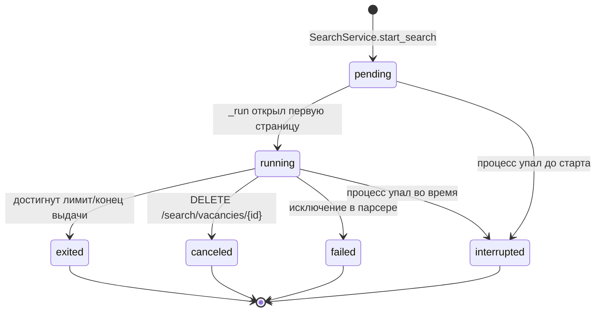
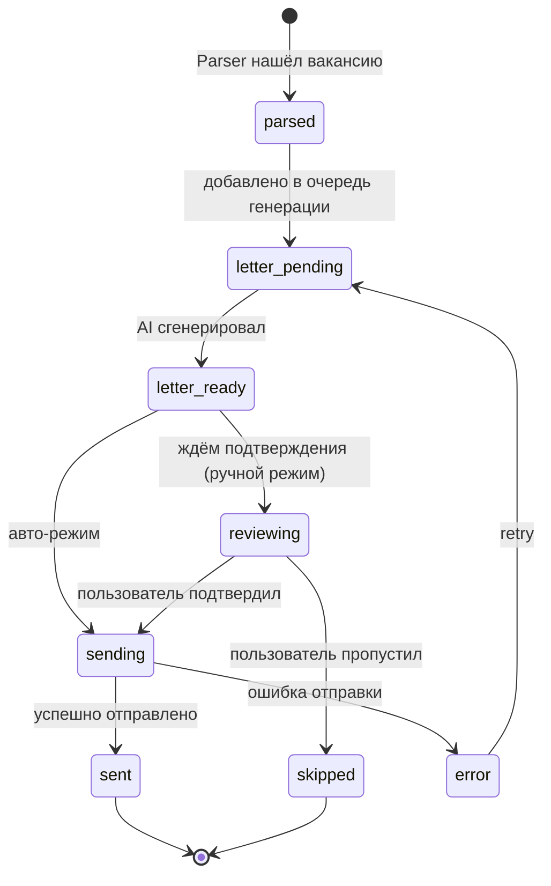

# Domain Model

Сущности проекта [[Description|Headhunter AI]].

> [!note] State machine `Application` ниже соответствует фактической `ProcessingStateMachine` (`orchestrator/state_machine.py`). Событие `letter_generated` поддерживает self-loop `LETTER_READY → LETTER_READY` и `LETTER_REVIEWING → LETTER_REVIEWING` — для повторной генерации без выхода из текущего состояния. Финальные состояния: `LETTER_SENT`, `SKIPPED`.

## Извлечено из исходного ТЗ

| Сущность | Атрибуты | Источник |
|---|---|---|
| `Vacancy` | description, title, salary, work_format, employer, employment_type, location, company_stars, published_at, apply_link | ТЗ |
| `Resume` | свободная форма, выгружается из hh.ru как контекст для AI | ТЗ |
| `SearchFilter` | критерии поиска (текст, регион, ЗП и т.п.) | ТЗ |
| `ChatContext` | характер + знания о соискателе | ТЗ |
| `Application` | vacancy + cover_letter + status (`pending` / `sent` / `error`) | ТЗ |

## Добавлено для реализации

| Сущность | Назначение |
|---|---|
| `CoverLetter` | сгенерированный текст, версии, метрика «принято/правлено» |
| `BrowserSession` | Chromium-профиль + куки hh.ru |
| `LLMProvider` | конфиг провайдера ([[AI Layer]]) |
| `RateLimitBudget` | оставшийся бюджет откликов (см. [[Anti-bot]]) |
| `AuditLog` | все действия системы (парсинг, генерация, отправка, ошибки) |
| `PromptTemplate` | YAML-шаблоны промптов с версиями |
| `SearchHistory` | persisted поисковый таск: `id` (UUID), `url`, лимиты (`max_pages`/`max_vacancies`), `status` ([[#State machine `SearchHistory`\|state machine]]), прогресс (`parsed_pages`, `parsed_vacancies`), `started_at`/`finished_at`, `error`. Связан с `Vacancy` через M2M-таблицу `search_vacancies`. |
| `FilterSession` | in-memory сессия пикера: открытая вкладка Chromium на `https://hh.ru/search/vacancy` для ручной настройки фильтров. Живёт до confirm/cancel/закрытия вкладки. |

`Vacancy` ↔ `SearchHistory` — many-to-many через ассоциативную таблицу `search_vacancies(search_id, vacancy_id)`. Парсер после `upsert_vacancy` вызывает `link_vacancy_to_search` (idempotent INSERT OR IGNORE). Если новый поиск перенаходит уже спарсенную вакансию — она присоединяется к новому `search_id`, не отвязываясь от прошлого. Миграция `a8c4f2d1e7b3` создала таблицу, забэкфилила из колонки `vacancies.search_id` (введённой `e5f9c1a273b4`) и удалила колонку.

## State machine `SearchHistory`

## State machine `Application`

## Хранение

Все сущности — в SQLite. См. [[Storage]] для схемы таблиц.

## Используется в
- [[Parser service]] — производит `Vacancy`
- [[Writer service]] — потребляет `Application` со статусом `sending`
- [[REST]] — CRUD по сущностям
- [[MCP]] — экспонирует tools для работы с `Vacancy` и `CoverLetter`
- [[AI Layer]] — генерирует `CoverLetter`
