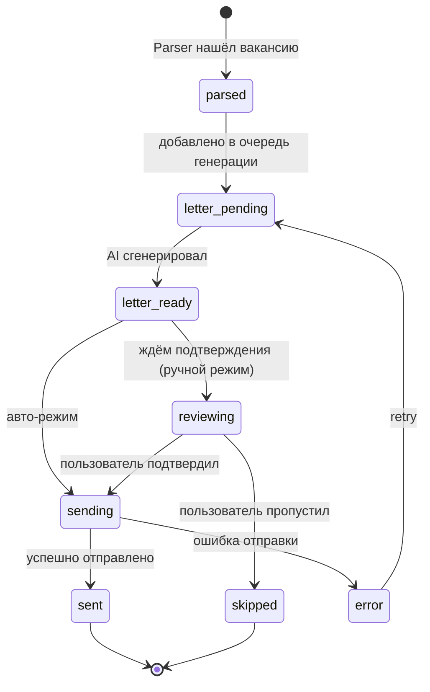

# Domain Model

Сущности проекта [[Description|Headhunter AI]].

## Извлечено из исходного ТЗ

| Сущность | Атрибуты | Источник |
|---|---|---|
| `Vacancy` | description, title, salary, work_format, employer, employment_type, location, company_stars, published_at, apply_link | ТЗ |
| `Resume` | свободная форма, выгружается из hh.ru как контекст для AI | ТЗ |
| `SearchFilter` | критерии поиска (текст, регион, ЗП и т.п.) | ТЗ |
| `ChatContext` | характер + знания о соискателе | ТЗ |
| `Application` | vacancy + cover_letter + status (`pending` / `sent` / `error`) | ТЗ |

## Добавлено для реализации

| Сущность | Назначение |
|---|---|
| `CoverLetter` | сгенерированный текст, версии, метрика «принято/правлено» |
| `BrowserSession` | Chromium-профиль + куки hh.ru |
| `LLMProvider` | конфиг провайдера ([[AI Layer]]) |
| `RateLimitBudget` | оставшийся бюджет откликов (см. [[Anti-bot]]) |
| `AuditLog` | все действия системы (парсинг, генерация, отправка, ошибки) |
| `PromptTemplate` | YAML-шаблоны промптов с версиями |

## State machine `Application`

## Хранение

Все сущности — в SQLite. См. [[Storage]] для схемы таблиц.

## Используется в
- [[Parser service]] — производит `Vacancy`
- [[Writer service]] — потребляет `Application` со статусом `sending`
- [[REST]] — CRUD по сущностям
- [[MCP]] — экспонирует tools для работы с `Vacancy` и `CoverLetter`
- [[AI Layer]] — генерирует `CoverLetter`
